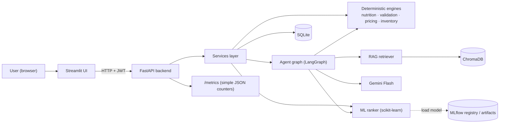
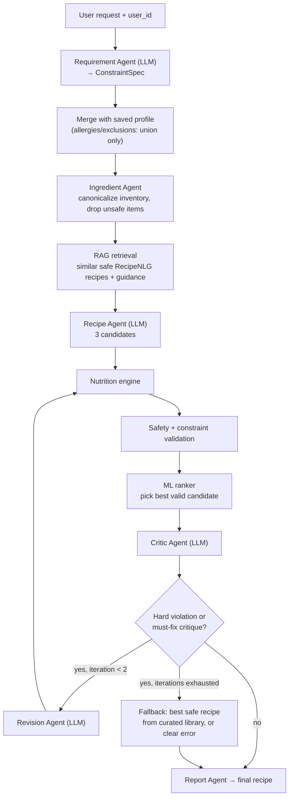
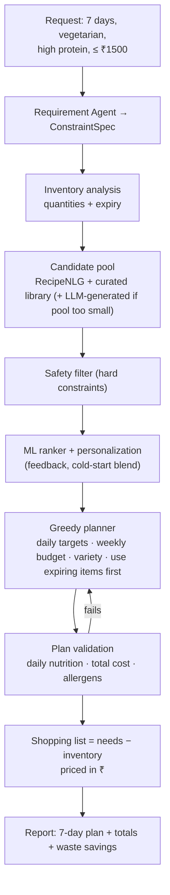
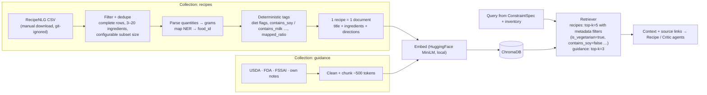
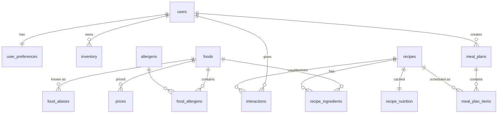
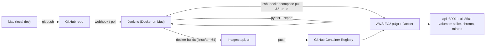

# NutriChef AI — Architecture (v1)

> Constraint-aware personalized meal planning & recipe intelligence platform.
> Status: Phase 1 design. Lives at `docs/architecture.md` in the repo.
> Nutrition values are estimates. NutriChef is a general wellness / meal-planning tool, not a medical device, and never guarantees allergy safety.

---

## 1. Design principles

1. **LLMs propose, Python decides.** LLMs understand text and write/critique recipes. Nutrition, allergens, diet rules, constraints, prices and ranking are deterministic code or ML.
2. **Safety is sticky.** Allergies and exclusions saved in the profile can be *added to* by the LLM, never removed. A recipe with a hard violation is never returned.
3. **Unknown = unsafe.** An ingredient that can't be mapped to the food database blocks "validated" status until it is replaced or mapped.
4. **Business logic lives in `services/` and engines**, not in API routes or Streamlit.
5. **Everything testable offline.** LLM, embeddings and clock are injectable; tests use fakes.
6. **Simple first.** One process for the API, SQLite + Chroma files, one EC2 host. No Kubernetes, Kafka, Spark or Airflow.

---

## 2. System context



---

## 3. Layers and responsibilities

| Layer | Folder | Responsibility | Uses LLM? |
|---|---|---|---|
| UI | `ui/` | Forms, results, feedback. Calls API only. | No |
| API | `app/api/` | Routing, auth, request/response schemas, error mapping | No |
| Services | `app/services/` | Use-case orchestration: generate recipe, plan meals, record feedback | No (calls graph) |
| Agents | `app/agents/` | LLM agents + LangGraph workflow | Yes |
| Nutrition engine | `app/nutrition/` | Unit conversion → grams → nutrients from food DB | No |
| Validation | `app/validation/` | Allergen, diet, exclusion, nutrition, budget, time checks | No |
| Pricing / inventory | `app/services/pricing.py`, `inventory.py` | Cost estimation, inventory matching, expiry/waste scores | No |
| RAG | `app/rag/` | Ingest, chunk, embed, retrieve with sources | Embeddings only |
| ML | `app/ml/` (inference), `ml/` (training) | Features, ranker, cold-start blending | No |
| Data access | `app/database/` | SQLAlchemy models, session, repositories | No |
| Core | `app/core/` | Settings, logging, simple metrics, security, LLM factory | — |

---

## 4. Agents — who does what

| Agent | Type | Input → Output |
|---|---|---|
| Requirement Agent | **LLM** (structured output) | free text → `ConstraintSpec` (diet, allergens, exclusions, targets, budget, time, cuisine, inventory, meal type) |
| Ingredient Agent | Deterministic | raw ingredient names → canonical `food_id`s, flags unsafe/unknown items, expiry priority |
| Recipe Agent | **LLM** | constraints + inventory + RAG context → N candidate `RecipeDraft`s (ingredients in grams, chosen from allowed foods where possible) |
| Safety Agent | Deterministic | recipe → `ValidationReport` (hard violations, soft issues, unmapped ingredients) |
| Critic Agent | **LLM** | recipe + nutrition + validation report → `Critique` (issues, severity, suggested fixes) |
| Revision Agent | **LLM** | recipe + critique + violations → revised `RecipeDraft` |
| Meal Planning Agent | Deterministic optimizer (+ Recipe Agent to fill gaps) | pool of ranked safe recipes → N-day plan within budget/targets/variety |
| Report Agent | Deterministic formatter (+ optional short LLM explanation) | final state → `RecipeResponse` / `MealPlanResponse` with disclaimers & sources |

Only 4 components call the LLM. Everything that must be *correct* is deterministic.

---

## 5. Recipe generation workflow (Scenario 1)



**Graph state (`RecipeState`)**: `request_text, user_id, constraints, inventory, context_docs, candidates, current, nutrition, validation, critique, iteration, status, trace[]`.

**Hard constraints** (must pass): allergens, excluded ingredients, diet rules, calorie ceiling, no unmapped ingredients.
**Soft constraints** (scored, reported): protein/fiber targets, cooking time, cost, cuisine, inventory usage, skill level.

**Allergen check detail**: ingredient → `food_id` → `food_allergens` table, plus an alias/derivative list (e.g. soy → soya, tofu, tempeh, edamame, soy sauce, soy lecithin; whey → milk). Word-boundary matching, never raw substring (reference-repo bug: "soy milk" matched "milk").

---

## 6. Meal plan workflow (Scenario 2)



Planner scoring per slot:
`score = w1·ranker_prob + w2·nutrition_fit + w3·inventory_use + w4·expiry_urgency − w5·cost − w6·repeat_penalty`
Weights live in config. A recipe isn't repeated within 2 days; total cost must be ≤ budget (hard).

---

## 7. RAG pipeline (two collections)

RecipeNLG (Bień et al., INLG 2020; ~2.2M recipes; columns `title, ingredients, directions, link, source, NER`) is the **recipe knowledge base**. A small guidance corpus covers what RecipeNLG does not (nutrition, allergens, diet rules, substitutions, food safety).



**How RecipeNLG is used**
- **Retrieval-augmented generation:** similar, constraint-compatible recipes are retrieved and the Recipe Agent *adapts* them (use available paneer/eggs, remove whey, hit protein target). Final output cites `Adapted from: <link>`.
- **Recipe library:** parsed rows with ≥ 90 % of ingredients mapped to the food DB are stored in `recipes` (origin=`recipenlg`) with computed nutrition → used by the ML ranker and meal planner.
- **Metadata pre-filtering** removes obviously unsafe recipes before the LLM sees them; the Safety Agent still re-validates everything afterwards (metadata filters are a convenience, not the safety guarantee).
- Recipes are never chunked mid-recipe; Chroma metadata stores allergens/diet as scalar boolean flags.

**Constraints of the dataset (and mitigations)**

| Issue | Mitigation |
|---|---|
| License: *non-commercial research & educational use only*; download requires accepting terms | Project is educational/non-commercial; data never committed to git or baked into Docker images; attribution + terms in `docs/data_sources.md`; public demo labeled non-commercial |
| Recipe text originates from third-party websites | Keep `link`, show source, generate adapted recipes rather than republishing verbatim |
| No nutrition, no allergen labels | Our nutrition engine + allergen tables compute them |
| US-centric, cups/oz, free-text quantities | Fixed parser + unit/density conversion; Indian supplement set (curated, ~50 recipes) |
| 2.2M rows (~2 GB) too large for laptop dev / small EC2 | `RECIPENLG_SUBSET_SIZE` (dev 5k, demo ~50k); prefer `source=Gathered` rows; index built offline and mounted as a volume |
| Duplicates / noisy rows | Normalized-title + ingredient-set dedupe, row-level quality checks |

- Guidance topics: `nutrition`, `allergens`, `diet_rules`, `substitutions`, `cooking`, `food_safety`.
- RAG *informs* the LLM; it never overrides deterministic checks.
- Every source records its license in `docs/data_sources.md`.
- Retrieved text is wrapped as quoted data in prompts (prompt-injection guard — scraped recipe text is untrusted).

---

## 8. ML personalization / ranking

| Item | Decision |
|---|---|
| Task | Pointwise: P(user likes recipe) — label = like / save / rating ≥ 4 (positive) vs dislike / skip / rating ≤ 2 (negative) |
| Models | Baselines: popularity, rule-based score → Logistic Regression → Gradient Boosting |
| Features | calorie_match, protein_match, ingredient_overlap, inventory_coverage, diet_match, cuisine_pref, time_fit, budget_fit, skill_fit, user_cuisine_affinity, user_ingredient_affinity, recipe_popularity, user_avg_rating |
| Data | Simulated users & interactions (labeled `synthetic=true`) + real app feedback over time |
| Split | Per-user time-based leave-last-out (no leakage) |
| Metrics | Precision@K, Recall@K, HitRate@K, NDCG@K (K = 5, 10), plus ROC-AUC |
| Cold start | users with < 5 interactions: `score = α·rule_score + (1−α)·model_score`, α = 1 − n/5 |
| Tracking | MLflow: params, metrics, model, feature list, data version; registered model `nutrichef-ranker`, alias `champion` |
| Serving | API loads `champion` at startup; falls back to rule score if no model (logged + metric) |

---

## 9. Data model (SQLite via SQLAlchemy)



| Table | Key columns |
|---|---|
| `users` | id, email, password_hash, created_at |
| `user_preferences` | user_id, diet, allergens (JSON), exclusions (JSON), cuisines (JSON), calorie_target, protein_target_g, max_cook_minutes, skill_level, budget_per_day |
| `foods` | id, name, category, kcal, protein_g, carbs_g, fat_g, fiber_g (per 100 g), is_vegetarian, is_vegan, source, source_ref |
| `food_aliases` | food_id, alias |
| `allergens` / `food_allergens` | allergen code (milk, egg, soy, peanut, tree_nut, wheat_gluten, fish, shellfish, sesame, mustard …) |
| `diet_rules` | diet, rule_type (forbid_category / forbid_food / require_flag), value |
| `prices` | food_id, price_inr, per_unit (kg/l/piece), region, source, as_of |
| `recipes` | id, name, cuisine, meal_type, cook_minutes, skill, servings, instructions (JSON), origin (recipenlg/curated/generated), source_url, external_id, mapped_ratio, created_at |
| `recipe_ingredients` | recipe_id, food_id, grams, display_qty, display_unit |
| `recipe_nutrition` | recipe_id, per-serving kcal/protein/carbs/fat/fiber, cost_inr, computed_at |
| `inventory` | user_id, food_id, grams, expires_on |
| `interactions` | user_id, recipe_id, event (view/like/dislike/save/skip/rate/cook), value, reason, created_at |
| `meal_plans` / `meal_plan_items` | plan: user_id, start_date, days, budget, totals (JSON); item: day, slot, recipe_id, servings |
| `generation_runs` | id, user_id, kind, iterations, status, latency_ms, model, violations (JSON), created_at — audit/observability |

Feedback is stored as `interactions` with `event` + optional `reason`.

Tables are created at startup with SQLAlchemy `Base.metadata.create_all()` (no migration tool). If the schema changes during development, the local SQLite file is deleted and re-seeded.

---

## 10. API (FastAPI, prefix `/api/v1`)

| Method | Path | Purpose | Auth |
|---|---|---|---|
| POST | `/auth/signup`, `/auth/login` | Account + JWT | – |
| GET/PUT | `/users/me/profile` | Preferences (brief's `POST /users/profile`) | ✔ |
| GET/PUT | `/users/me/inventory` | Ingredient inventory | ✔ |
| POST | `/ingredients/analyze` | Canonicalize + flag ingredients | ✔ |
| POST | `/nutrition/calculate` | Nutrition for an ingredient list | – |
| POST | `/recipes/generate` | Full agent workflow | ✔ |
| POST | `/recipes/validate` | Validation report for a recipe | ✔ |
| POST | `/recipes/revise` | Revise a recipe with instructions | ✔ |
| GET | `/recipes/{id}`, `/users/me/history` | Retrieve | ✔ |
| POST | `/meal-plans/generate` | N-day plan | ✔ |
| POST | `/feedback` | like/dislike/rate/save/skip + reason | ✔ |
| GET | `/health` | liveness + DB/vector store/model status | – |
| GET | `/metrics` | Simple JSON counters and timings | internal |

Errors: consistent `{"error": {"code", "message", "request_id"}}`; internal details only in logs.

---

## 11. Observability

Kept deliberately simple: an in-memory counters dictionary exposed as JSON at `/metrics`, plus Python's built-in `logging`.

| Area | What is tracked |
|---|---|
| API | request count per route and status code, average latency, error count |
| LLM | calls per agent, failures, average latency, token usage (when Gemini returns it) |
| RAG | retrieval count, failures, average latency; sources logged per run |
| Agents | time per step, failures, number of revision iterations |
| ML | loaded model version, prediction count, average prediction latency, fallback count |

Logs: plain text lines (`time | level | module | message`) including a request id and step timings. Secrets are masked; no personal data in prompts is logged at INFO level.

---

## 12. Security & responsible AI

- Secrets only in `.env` (git-ignored); `.env.example` committed. `pydantic-settings` fails fast if missing.
- JWT bearer tokens (Streamlit stores in session state), bcrypt hashes, short expiry.
- Pydantic limits on every input (text ≤ 1000 chars, days ≤ 14, budget > 0 …).
- Simple per-user rate limit on LLM endpoints (protects free-tier quota).
- Prompt injection: raw user text only reaches the Requirement Agent, inside delimiters; downstream agents receive structured data; all LLM output is schema-validated; safety is deterministic anyway.
- Disclaimers in every recipe/plan response and in the UI.
- Minimal personal data; user can delete their account and data.

---

## 13. Deployment



- **Docker** = packaging/runtime. **GHCR** = image storage. **Jenkins** = automation. **AWS EC2** = the machine. **FastAPI** = the backend inside the container.
- Billing alarm before any AWS resource; security group opens only 22 (your IP) and 80/443.

---

## 14. Repository layout

```text
nutrichef-ai/
├── app/
│   ├── main.py                 # FastAPI app factory
│   ├── api/                    # routers: auth, users, recipes, meal_plans, nutrition, feedback, health
│   ├── agents/                 # requirement.py, recipe.py, critic.py, revision.py, prompts.py, graph.py, meal_plan_graph.py
│   ├── core/                   # config.py, logging.py, metrics.py, security.py, llm.py
│   ├── schemas/                # Pydantic: constraints, recipe, nutrition, validation, plan, user, feedback
│   ├── services/               # recipe_service, meal_plan_service, feedback_service, pricing, inventory, planner
│   ├── nutrition/              # units.py, food_matcher.py, calculator.py
│   ├── validation/             # allergens.py, diet.py, constraints.py, report.py
│   ├── rag/                    # ingest.py, splitter.py, embeddings.py, store.py, retriever.py
│   ├── datasets/               # usda.py, recipenlg.py, reference.py (data loaders)
│   ├── ml/                     # features.py, ranker.py, cold_start.py
│   └── database/               # base.py, session.py, models.py, repositories/
├── ui/                         # streamlit_app.py, pages/, api_client.py
├── ml/
│   ├── training/               # simulate_interactions.py, build_dataset.py, train.py
│   ├── evaluation/             # metrics.py (P@K, R@K, HR, NDCG), evaluate.py
│   └── artifacts/              # git-ignored
├── data/
│   ├── reference/  knowledge_base/          # small curated files (committed)
│   ├── raw/  processed/  interactions/      # git-ignored
├── scripts/                    # download_usda.py, seed_db.py, ingest_kb.py, demo_*.py
├── tests/
│   ├── unit/ integration/ api/ agents/ rag/ ml/
│   └── conftest.py             # fake LLM, temp DB, fake embeddings
├── docker/                     # api.Dockerfile, ui.Dockerfile
├── docs/                       # architecture.md, data_sources.md
├── notebooks/
├── docker-compose.yml  Jenkinsfile  requirements.txt  requirements-dev.txt
├── pytest.ini                  # pytest config
├── .env.example  .gitignore
└── README.md
```

---

## 15. Key decisions (short ADRs)

| # | Decision | Alternatives | Reason |
|---|---|---|---|
| 1 | LangGraph for the recipe loop | Plain Python loop | Explicit state + conditional edge fits generate→validate→critique→revise; still ~100 lines |
| 2 | Deterministic nutrition from USDA (+ cited Indian values) | LLM estimates, paid APIs | Correctness, free, public-domain |
| 3 | RecipeNLG subset as RAG knowledge base + recipe library, plus ~50 curated Indian recipes | Fully curated library; other scraped datasets | Large, well-known research dataset with NER field; non-commercial terms accepted for this educational project |
| 4 | Greedy planner | ILP solver (PuLP) | Easy to understand; ILP is a possible later upgrade |
| 5 | SQLite + Chroma files | Postgres + pgvector | Zero setup; swap later via SQLAlchemy |
| 6 | Bearer JWT | Cookies (reference repo) | Streamlit can't manage HttpOnly cookies cleanly |
| 7 | EC2 + compose, GHCR | ECS Fargate + ECR | Free-tier budget; ECS remains an upgrade path |
| 8 | Synthetic interactions, clearly labeled | No ML until real users | Enables a genuine, evaluated model now |

---

## 16. Phase map

| Phases | Delivers |
|---|---|
| 2 | Repo, venv, config, logging, tooling |
| 3–4 | USDA foods, allergens, diet rules, prices, RecipeNLG download + filtering/parsing, curated Indian recipes, guidance docs, features |
| 5–6 | Nutrition engine, validation |
| 7 | Ranker + MLflow |
| 8 | RAG |
| 9–11 | Agents, graph, recipe generation |
| 12 | Meal planning, inventory, waste, budget |
| 13–15 | API, DB integration, Streamlit |
| 16–17 | Test suite, observability |
| 18–20 | Docker, Jenkins, EC2 |
| 21–24 | E2E, hardening, docs, demo |
