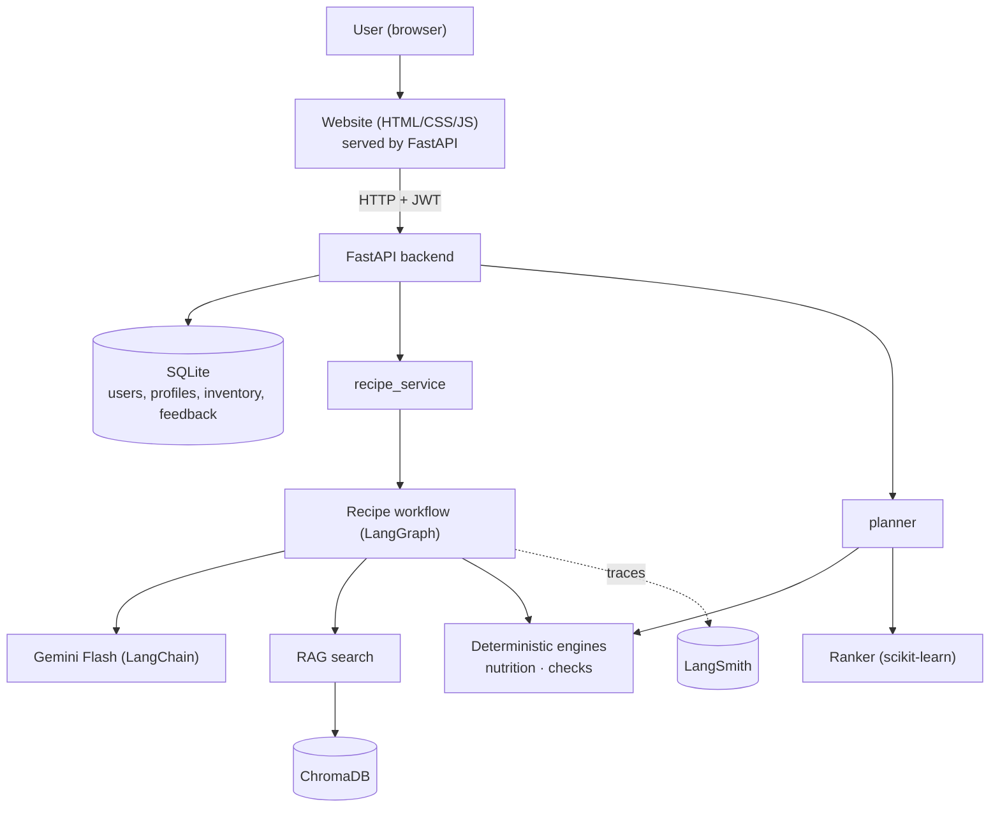
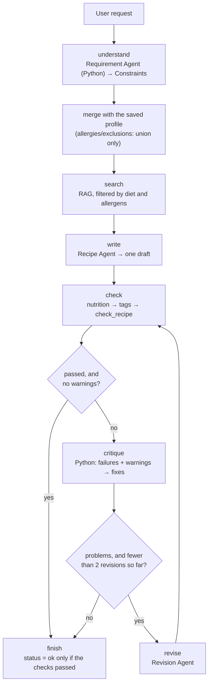
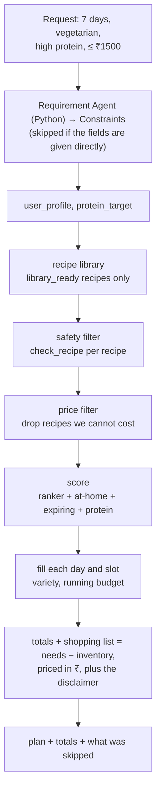
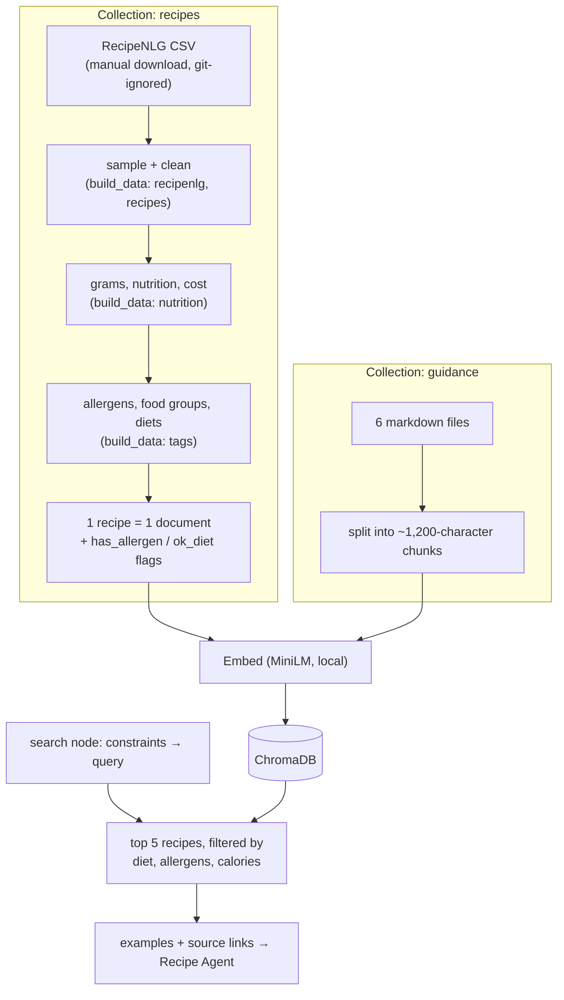
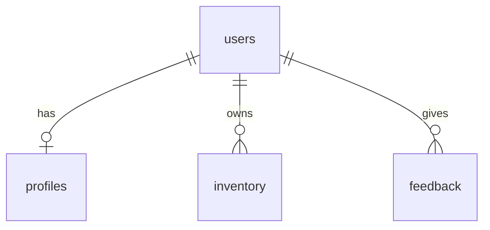
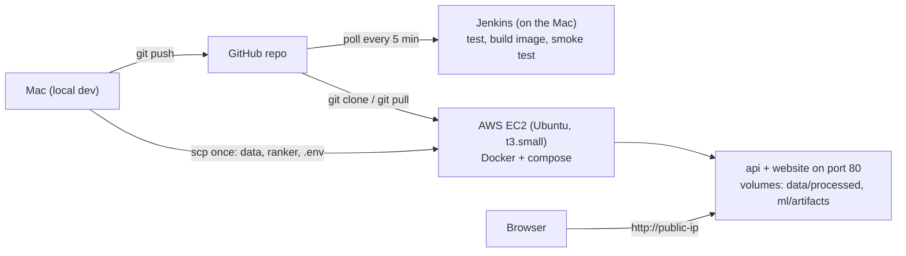

# NutriChef AI — Architecture (v2)

> Constraint-aware personalized meal planning & recipe intelligence platform.
> Status: v2 describes what is built and running: Phases 0-20 (through Docker, Jenkins and AWS EC2) plus hardening (account deletion, an hourly recipe limit).
> Nutrition values are estimates. NutriChef is a general wellness / meal-planning tool, not a medical device, and never guarantees allergy safety.

---

## 1. Design principles

1. **LLMs propose, Python decides.** LLMs understand text and write/critique recipes. Nutrition, allergens, diet rules, constraints, prices and ranking are deterministic code or ML.
2. **Safety is sticky.** Allergies and exclusions saved in the profile can be *added to* by the LLM, never removed. A recipe with a hard violation is never returned.
3. **Unknown = unsafe.** An ingredient that can't be mapped to the food database blocks "validated" status until it is replaced or mapped.
4. **Business logic lives in `services/` and engines**, not in API routes or the website.
5. **Everything testable offline.** LLM, embeddings and clock are injectable; tests use fakes.
6. **Simple first.** One process for the API, SQLite + Chroma files, one EC2 host. No Kubernetes, Kafka, Spark or Airflow.

---

## 2. System context



One Python process serves both the API and the website. Only writing and rewriting a recipe
uses the LLM; the meal-plan path, and reading any request, is plain Python.

---

## 3. Layers and responsibilities

| Layer | Folder | Responsibility | Uses LLM? |
|---|---|---|---|
| API | `app/api/` | Routing, request/response schemas, error mapping | No |
| Services | `app/services/` | `recipe_service` (Scenario 1), `planner` (Scenario 2) | No (calls the agents) |
| Agents | `app/agents/` | 4 agents (2 call Gemini), the LangGraph workflow, their output schemas, RAG search (`rag.py`) | Yes (search: embeddings only) |
| Nutrition engine | `app/nutrition/` | Parse → grams → nutrients and cost; allergen, diet and limit checks (`checks.py`) | No |
| ML | `app/ml/` | Features, ranker, cold-start blend, metrics. Training is `scripts/train_ranker.py` | No |
| Data | `app/data/` | Read USDA / RecipeNLG / reference files, clean them into recipes | No |
| Core | `app/core/` | Settings, logging, the Gemini factory, LangSmith tracing | — |
| Website | `web/` | `index.html`, `styles.css`, `app.js`. Talks HTTP only, never imports the services | No |
| Data access | `app/database/` | `models.py` (4 tables) and `session.py` | No |

Pricing and inventory are not separate modules: prices live in the nutrition calculator
(`price_per_gram`) and inventory handling is a few functions in the planner. Splitting them out
would add files without adding clarity.

---

## 4. Agents — who does what

Four agents. Two are truly deterministic plain Python; two call Gemini, only where writing is
needed. Everything that must be *correct* is deterministic and lives elsewhere.

| Agent | Input → Output | Where |
|---|---|---|
| Requirement (Python, no LLM) | free text → `Constraints`: words from fixed lists (diets, allergens, courses) and numbers next to units ("600 calories", "25 g protein") | `app/agents/requirements.py` |
| Recipe | the person's words (fenced as data) + the rules read from them + RAG context → one `RecipeDraft`, quantities in grams | `generate_recipe` |
| Critic (Python, no LLM) | our check results → `Critique`: each failure and warning, the exact ingredient lines that caused it, and safe swaps | `critique_recipe` |
| Revision | recipe + critique → a fixed `RecipeDraft` | `revise_recipe` |

Every answer is cached on disk by `CachedLLM` (`app/core/llm.py`), keyed by the prompt **and**
the model name. The free Gemini tier allows about 20 requests per day per project per model, and
one recipe run costs 1-3 of them, so without a cache a UI is unusable. The trade-off is that a
cached answer is the old answer: change a prompt, clear the cache.

**Deterministic by design.** Two agents are truly deterministic: the Requirement Agent and the
critic are plain Python, so the same input always gives the same output, on any machine. The two
Gemini agents cannot be: Google runs the model on shared servers, where tiny rounding
differences can change a word, and can update it under the same name. They are made
*repeatable* instead, so the same request gives the same result on this machine:

1. **Saved answers.** The cache is on by default (`LLM_CACHE=true`), so a prompt Gemini has
   answered once is answered from disk from then on, word for word.
2. **Most likely answer.** Gemini is called with `temperature=0` and `seed=42` (`app/core/llm.py`).
   Some Gemini models ignore these, which is why the cache is the real guarantee.
3. **No LLM where rules will do.** Reading the request and the critique are Python, and
   nutrition, allergens, diets, checks, search, ranking and planning were already Python.
4. **Stable prompts.** Each prompt is built the same way every time (saved allergies are merged
   in sorted order), so the same request always hits the same saved answer.

Two things still change the answer: clearing the cache, or changing a prompt, the model name or
the search index (the prompt text changes, so it is a new question).

`invoke_with_retry` (same file) sits in `agents.ask`, so both Gemini agents share it. A 503 ("high
demand") is temporary and is retried up to three times with a growing pause; a 429 is the daily
allowance and is not retried at all - it raises `QuotaExhausted`, which the API turns into a 503
with a sentence the person can act on. Together with the cache this means a run that dies
half-way replays its completed steps for free on the next attempt.

The deterministic steps around them: RAG search (`app/agents/rag.py`), nutrition
(`app/nutrition/calculator.py`), tagging and checks (`app/nutrition/checks.py`), ranking
(`app/ml/ranker.py`) and planning (`app/services/planner.py`). The LLM never decides whether a
recipe is safe - `check_recipe` does, and its verdict sets the returned status.

---

## 5. Recipe generation workflow (Scenario 1)



A draft that passes every check with no warnings is finished. Anything else goes to the critic,
which is plain Python: it lists every failure and warning from `check_recipe`, names the exact
ingredient lines that caused each one, and suggests safe swaps (for "contains soy": *replace 200 g
tofu; safe swaps: paneer or chickpeas instead of tofu*). A swap is only offered if it breaks none
of the person's other rules, so someone allergic to milk and soy is never told to use tofu. The
Revision Agent rewrites the recipe from that list and it is checked again, at most twice.

Three more things make sure an allergen is really replaced, not just found:

1. **Every prompt spells out each allergy.** "Milk" alone is not enough; the prompt lists the
   24 ingredients that count as milk (paneer, ghee, curd, khoa …), from the same table the
   checks use.
2. **Safety beats the dish.** If they ask for "paneer tikka" with a milk allergy, Gemini is told
   to make a version without paneer, not to keep the dish exactly as named.
3. **Each rewrite is a new question.** The attempt number is in the rewrite prompt. Without it,
   a second rewrite of the same failed recipe would be the same prompt, and the saved-answer
   cache would hand back the same failed recipe. The critic used to be a Gemini
call; it only ever restated our own check results, so making it Python made the loop
deterministic and saved one call per rewrite.

**Graph state** (a plain dict, `app/agents/graph.py`): `request_text, profile, constraints, context, sources, draft, recipe, nutrition, checks, critique, revisions, status, trace[]`.

**Hard rules** (must pass, or the status is `failed`): allergens, excluded ingredients, diet rules, the calorie and cost ceilings, nutrition confidence below `high`, and macros that exceed the calories.
**Soft rules** (reported as warnings): protein target, cooking time, cuisine.

**Allergen check detail**: each ingredient's name plus its catalog name is matched against the keyword table with whole-word matching and a plural tolerance, so "eggplant" never counts as "egg". An exceptions list stops "coconut milk" counting as milk (the reference repo's substring matching got both of these wrong).

---

## 6. Meal plan workflow (Scenario 2)

Plain Python functions in `app/services/planner.py`, called in order by `make_plan`. Every step
is deterministic — the LLM's only appearance is the optional first box.



This used to be a LangGraph pipeline too. It was a straight line with no decision to make — a
retry edge that lowered the per-meal budget returned the same plan every time — so it is now
ordinary function calls. LangGraph stays where it earns its place: the recipe loop, which does
branch.

Planner scoring per slot (`app/services/planner.py`):
`score = ranker_score + 0.3 · share_of_ingredients_at_home + 0.2 · uses_something_expiring
         + 0.4 · reaches_the_protein_target + 0.5 · they_liked_it` (disliked recipes are removed first)

The ranker score is the Phase 7 model (rule score blended in for new users). Filtering happens
before scoring: only recipes that pass `check_recipe` for this person enter the pool, so
allergens, diet and cost limits are never traded off against a score. When a budget is given,
recipes whose `cost_coverage` is below 0.8 are also dropped: most of their ingredients have no
price, so they look almost free and would otherwise win every slot (the filter is skipped if it
would leave too few recipes to plan with). Slots are filled greedily,
day by day, and variety is tried in three steps: a recipe not yet in the plan at all; failing
that, one not eaten for 3 days; failing that, anything not already eaten today. The running
budget is a hard limit, and it is paced: each pick keeps back enough money for the cheapest
possible meal in every slot still to fill, so a pricey favourite on day 1 cannot leave day 7
empty.

Breakfasts are rare in the library (most RecipeNLG recipes are mains), so a soy allergy plus a
dislike or two can remove every breakfast. The slot is then filled from a nearby course
(breakfast → snack → main; snack → breakfast → side) and marked `stand_in`, and the page says
so. Only a slot that nothing safe can fill is reported in `skipped`, with its real reason:
`no_recipe` or `budget`. A slot is never filled unsafely.
The shopping list subtracts what is already at home from what the plan needs and prices the
rest in ₹.

---

## 7. RAG pipeline (two collections)

RecipeNLG (Bień et al., INLG 2020; ~2.2M recipes) is the **recipe knowledge base**. A small
guidance corpus (`data/knowledge_base/`, 6 markdown files) covers nutrition, allergens, diet
rules, substitutions, cooking basics and food safety.



- Code: `app/agents/rag.py`. Built by `python -m scripts.build_data index`.
- Each recipe's metadata stores `has_<allergen>` and `ok_<diet>` as true/false flags, so Chroma
  can filter before ranking by similarity.
- The filter is a convenience, not the safety guarantee: every written recipe is checked again
  by `check_recipe`.
- Retrieved text is untrusted, so it is placed in the prompt as quoted data.
- The guidance collection is indexed and searchable (`search_guidance`) but the recipe workflow
  does not use it yet.

**Dataset constraints and how they are handled**

| Issue | Mitigation |
|---|---|
| License: non-commercial research and educational use only | Educational project; data never committed to git or put in images; terms in `docs/data_sources.md` |
| Recipe text comes from third-party websites | Keep the source link; the LLM writes adapted recipes, not copies |
| No nutrition or allergen labels | Our nutrition engine and keyword tables compute them |
| US units (cups, oz) and free-text quantities | Parser plus unit and density conversion; 50 curated Indian recipes added |
| ~2 GB, too big for a laptop or small server | A sampled subset (`RECIPENLG_SUBSET_SIZE`, default 15,000) |

---

## 8. ML personalization / ranking

| Item | What is built |
|---|---|
| Task | P(user likes recipe), one recipe at a time |
| Models | Rule-score baseline, Logistic Regression, Gradient Boosting; the best by ROC-AUC is saved |
| Features | 11, in `app/ml/features.py`: calorie_fit, protein_fit, cost_fit, time_fit, cuisine_match, diet_match, ingredient_overlap, inventory_use, is_indian, is_curated, n_ingredients_scaled |
| Data | Simulated users and interactions (`scripts/train_ranker.py`, 200 users by default), labelled synthetic |
| Split | Per user, by time: the latest interactions are the test set |
| Metrics | Precision@5, Recall@5, HitRate@5, NDCG@5 (`app/ml/metrics.py`) and ROC-AUC |
| Cold start | `score = w·model + (1−w)·rule`, `w = min(n, 5) / 5` for a user with n interactions |
| Tracking | MLflow in `mlflow.db`; the chosen model goes to `ml/artifacts/ranker.joblib` |
| Serving | `planner.load_dependencies` loads the model once per process; no model file means rule score only |

**How a person's own ratings change their plans.** The model was trained on profile features,
not on who liked what, so a person's ratings reach the ranking in four plain ways
(`planner.personalize` and `build_plan`):

1. **"Not for me" is final.** A disliked recipe is removed before scoring and never suggested again.
2. **Liked recipes get a bonus** (+0.5), so favourites come back, within the no-repeat rules.
3. **Similar recipes rise.** The ingredients of liked recipes become `liked_ingredients` and their
   most-liked cuisine becomes `cuisine`; the `ingredient_overlap` and `cuisine_match` features
   then lift recipes like the ones they enjoyed.
4. **The model's weight grows with ratings.** The number of ratings is passed to the ranker, so
   the blend moves from the rule score to the model over the first five.

The website puts *Like* and *Not for me* on every meal of a plan (signed-in users), and a plan
built with ratings says "Tuned to your N ratings". Guests and people with no ratings get exactly
the plans they got before.

---

## 9. Data model (SQLite via SQLAlchemy)

Four tables in one file, `app/database/models.py`, created with `Base.metadata.create_all()`
when the app starts. No migration tool and no repository layer: the routes use a session
directly. Recipes, foods and prices are not in the database — they live in files that
`scripts/build_data.py` rebuilds.



| Table | Columns |
|---|---|
| `users` | id, email (unique), password_hash, created_at |
| `profiles` | user_id (unique), diet, allergies, exclude (semicolon-separated), min_protein_g, max_kcal, max_cook_minutes, budget_per_meal_inr |
| `inventory` | user_id, ingredient_id (unique per user), grams, expires_in_days |
| `feedback` | user_id, recipe_id, liked (1/0), reason, created_at |

Deleting a user deletes their profile, inventory and feedback (cascade); `DELETE /api/v1/users/me`
does this after the password is typed again. If the schema changes during development, the local SQLite file is deleted and
recreated.

File-based data (git-ignored, rebuilt by the scripts):

| File | Holds |
|---|---|
| `data/processed/usda_foods.csv`, `ingredient_foods.csv` | nutrients per 100 g, matched to the ingredient catalog |
| `data/processed/recipes_tagged.jsonl` | the recipe library: grams, nutrition, cost, allergens, diets, `library_ready` |
| `data/processed/chroma_db/` | the search index |
| `data/processed/llm_cache/` | cached Gemini answers |
| `data/interactions/*.csv` | simulated users and interactions |

---

## 10. API (FastAPI)

| Method | Path | Auth | Purpose |
|---|---|---|---|
| GET | `/health` | – | what is ready: recipes, ranking model, search index, LLM key |
| POST | `/api/v1/auth/signup`, `/api/v1/auth/login` | – | account; returns a JWT |
| GET/PUT | `/api/v1/users/me/profile` | required | saved diet, allergies, exclusions, targets |
| GET/PUT | `/api/v1/users/me/inventory` | required | what is at home (PUT replaces the list) |
| POST | `/api/v1/users/me/feedback` | required | like/dislike a recipe, with an optional reason |
| DELETE | `/api/v1/users/me` | required + password | delete the account and everything saved with it |
| POST | `/api/v1/recipes/generate` | optional | Scenario 1: free text → one checked recipe |
| POST | `/api/v1/plans/generate` | optional | Scenario 2: N-day plan inside a budget |
| GET | `/`, `/docs` | – | the website; the interactive API docs |

The two `generate` endpoints accept a token but do not require one. When a token is present the
saved profile is merged in with the union rule — saved allergies and exclusions are added to the
request's, never replaced — so principle 2 ("safety is sticky") holds at the API boundary too.

Both are thin: validate with Pydantic, call a service (`app/services/recipe_service.py`,
`app/services/planner.py`), return the result. The demo script calls the same services, so the
API and the command line run the same code.

Errors use FastAPI's `{"detail": ...}` shape: 401 for a missing or bad token, 409 for an email
already registered, 422 for input that fails validation, 429 when the hourly recipe limit is reached, 503 when something is missing (Gemini
key, recipe library), the daily Gemini quota is used up or Gemini is too slow, and 500 with a fixed message for
anything unexpected. Tracebacks only go to the logs.

---

## 11. Observability

**LangSmith**, and nothing else. `app/core/tracing.py` is the whole integration: `configure_tracing()`
copies the key, project and endpoint from `.env` into the environment variables LangSmith reads,
once, when the app starts. No key in `.env` means tracing is off and nothing is sent.

No decorators are needed, because LangChain and LangGraph report to LangSmith on their own:

| What | Seen in the trace |
|---|---|
| Every Gemini call: prompt, reply, tokens, time | LangChain |
| The recipe workflow, node by node | LangGraph (`app/agents/graph.py`) |
| The Python verdict | the `check` node's output: nutrition, `passed`, failures, warnings |

So a single recipe request reads: understand → search → write → check → (critique → revise →
check) → finish, and the `check` node shows the half of "the model proposes, Python decides" that
decides.

Logs: `time | level | module | message`, with `RedactSecretsFilter` masking anything that looks
like a key.

**What this costs.** LangSmith sees LLM and graph work only. HTTP routes and status codes are
not traced, and a meal plan never calls the model, so it leaves no trace at all. That was the deliberate price of using one observability tool, not two.

---

## 11a. Speed

Measured, not guessed: the real library's size (3,133 recipes), the same request and a trained
model file on disk. The plans chosen were identical before and after.

| Meal plan, typical request | Before | After |
|---|---|---|
| Tracing on | 11.2 s | 0.024 s |
| Tracing off | 1.36 s | 0.023 s |

| Recipe | Gemini calls before | after |
|---|---|---|
| First draft clean | 3 | 1 |
| Unsafe, fixed in one rewrite | 5 | 2 |

What was slow, and what changed:

1. **The ranker's answer was computed and thrown away.** With no interaction history its weight is
   zero, but it still ran for every safe recipe. It is now skipped at weight zero.
2. **Tracing sat on functions called once per recipe** — thousands of LangSmith runs per plan.
   Those decorators are gone; only LangChain and LangGraph report.
3. **The model file was read on every plan.** Now once per process (`planner.load_dependencies`,
   cached with `lru_cache`).
4. **Every request fetched its trace link** from LangSmith. Removed.
5. **A busy Gemini meant up to 45 s of sleeping per call.** Retry waits are now 4 s then 8 s, and
   the answer cache replays finished steps for free.
6. **The critic read drafts Python had already passed**, and was a Gemini call at all (§5). It is
   now plain Python.
7. **Every Gemini call thought at "medium"** (the model's default). All calls now ask for `low`
   (`LLM_THINKING` in `.env`).
8. **Answers came back as prose around JSON.** Every call now asks for `application/json` only.

Run without Docker, the first request after the server starts loads the library and tables, so it
is slower than the rest. In Docker, `WARM_UP=true` loads them when the container starts instead.

Items 7 and 8 can only be timed against Gemini itself:
`python -m scripts.demo recipe --no-cache --thinking medium`, then `--thinking low`, prints each
step's seconds. Compare the revision count too — if the writer misses targets more often at
`low`, set `LLM_THINKING=medium`.

---

## 12. Security & responsible AI

- Secrets only in `.env` (git-ignored); `.env.example` committed. `pydantic-settings` fails fast if missing.
- JWT bearer tokens (the website keeps one in the browser), bcrypt hashes, 60-minute expiry.
- Pydantic limits on every input (text length, days ≤ 14, budget > 0, list sizes …).
- Free-tier quota is protected by the answer cache, by not retrying a 429, and by an hourly limit on recipe requests per person (`app/api/limits.py`: `RECIPE_REQUESTS_PER_HOUR`, default 20, counted in memory per account or per address when signed out; over it, a 429 with `Retry-After`). Meal plans never call Gemini, so they are not limited.
- Prompt injection: the person's words reach Gemini only inside `<<< >>>`, marked as data, with any `<<<`/`>>>` in them removed so they cannot close the fence; the hard limits come separately from the Python Requirement Agent; all LLM output is schema-validated; safety is deterministic anyway.
- Disclaimers in every recipe/plan response and in the UI.
- Minimal personal data: email, password hash, profile, inventory, feedback. `DELETE /api/v1/users/me` (with the password typed again) deletes the account and, by cascade, everything saved with it; the website offers it on the My kitchen page.

---

## 13. Deployment

Phase 18 (Docker), Phase 19 (Jenkins) and Phase 20 (EC2) are built.

**Jenkins, as built.** Jenkins runs on the Mac (Homebrew) and checks every change pushed to
GitHub (it polls every 5 minutes; *Build Now* works too). The `Jenkinsfile` takes a clean copy
of the code, not the working folder, and runs four stages: **Setup** (a `.venv` with the
requirements) → **Test** (`pytest`; an HTML report opens in the browser when the stage ends and is kept with the build, and the results are also published as a JUnit report with a trend graph) → **Build
image** (`nutrichef-ai:<build number>` and `:latest`) → **Smoke test** (start the image and wait for
`/health`, asked from inside the container so no port can clash). The tests need no `.env`, no data and no Gemini. Rebuilding the
data and the ranker stays a manual step, because the raw data is not on GitHub.

**Docker, as built.** One image runs the API and the website (`Dockerfile`, `compose.yml`,
`.dockerignore`):

| Choice | Why |
|---|---|
| `python:3.11-slim`, then CPU-only PyTorch, then `requirements.txt`, then the code | CPU PyTorch saves about 2 GB; libraries before code, so a code change rebuilds in seconds |
| Code and small reference files only in the image | RecipeNLG is non-commercial and must not be shipped; the library, index, database and saved answers are mounted from `data/processed`, the ranker read-only from `ml/artifacts` |
| `.env` read by compose at run time | keys never enter the image |
| a normal user (`chef`, uid 1000) | the app does not run as root |
| `HEALTHCHECK` on `/health` | Docker can tell when it is up or stuck, locally and on EC2 |
| the search model baked into the image, `HF_HUB_OFFLINE=1` | no download or Hugging Face check at start |
| `WARM_UP=true` | the library, tables and search model load when the container starts, so the first visitor only waits for Gemini; a missing key or data is logged, never fatal |
| port `${PUBLISH_PORT:-127.0.0.1:8000}` | locally only this computer can reach it; the server sets `PUBLISH_PORT=80` on purpose |

A ranker saved by a different scikit-learn version cannot always be read back, so `load_model`
falls back to the rule score and logs a warning instead of breaking every plan.

**EC2, as built.** One Ubuntu server (t3.small, 20 GiB, Mumbai) runs the same
`docker compose` as the Mac. The code comes from GitHub (`git clone`); what git does not hold
(the data in `data/processed`, the ranker in `ml/artifacts` and `.env`) is copied across once
with `scp`. On the server `.env` sets `ENVIRONMENT=production` (the app then refuses a weak JWT
secret or a missing Gemini key), a new `JWT_SECRET_KEY`, and `PUBLISH_PORT=80`, which
`compose.yml` uses in place of `127.0.0.1:8000`. A 2 GB swapfile lets the image build on 2 GB of
memory. Updating is `git pull` then `docker compose up -d --build`. Steps: README, "Deploy on
AWS EC2".



- **Docker** = packaging and runtime. **Jenkins** = checks every change. **AWS EC2** = the
  machine. **FastAPI** = the backend inside the container.
- Security group: SSH (22) from your IP only, HTTP (80) from anywhere. Plain HTTP is fine for a
  demo; real users would need HTTPS (a domain and a certificate) in front.
- Cost: the instance and its disk cost money while they exist. Stop it when not in use;
  terminate it to delete everything.

---

## 14. Repository layout

Every file here is used; anything that stopped being used has been deleted.

```text
nutrichef-ai/
├── app/
│   ├── api/          main.py (the app), routes.py, auth.py, users.py, schemas.py, limits.py (hourly recipe limit)
│   ├── agents/       prompts.py, agents.py (write, critique, revise), requirements.py (reads the request),
│   │                 graph.py (LangGraph workflow),
│   │                 schemas.py (the LLM output contract), rag.py (ChromaDB search)
│   ├── core/         config.py, logging.py, llm.py, security.py, tracing.py
│   ├── data/         usda.py, recipenlg.py, reference.py, recipes.py, features.py
│   ├── database/     models.py (4 tables), session.py
│   ├── ml/           features.py, ranker.py, metrics.py
│   ├── nutrition/    parsing.py, units.py, food_matcher.py, calculator.py,
│   │                 checks.py (allergens, diets, limits - the safety layer)
│   └── services/     recipe_service.py (Scenario 1), planner.py (Scenario 2)
├── web/              index.html, styles.css, app.js (served by FastAPI)
├── ml/artifacts/     ranker.joblib (git-ignored)
├── data/
│   ├── reference/    7 CSVs - catalog, allergen and food-group keywords, exceptions,
│   │                 diets, prices, curated recipes (committed)
│   ├── knowledge_base/  markdown docs for RAG (committed)
│   └── raw/ processed/ interactions/   (git-ignored, rebuilt by the scripts)
├── scripts/          build_data.py, train_ranker.py, demo.py, check.py
├── tests/            one file per area + conftest.py, helpers.py
├── docs/             architecture.md, data_sources.md
├── Dockerfile  compose.yml  .dockerignore  Jenkinsfile
├── requirements.txt  requirements-dev.txt  pytest.ini  .env.example  .gitignore
└── README.md
```

`python -m scripts.build_data` runs every step in this order (or name the steps you want);
`python -m scripts.train_ranker` then simulates users and trains the ranker:

```text
usda ─────────┐
recipenlg ────┴─> foods -> recipes -> nutrition -> tags -> index
                                                    └─> train_ranker (simulate users, train)
```

---

## 15. Key decisions (short ADRs)

| # | Decision | Alternatives | Reason |
|---|---|---|---|
| 1 | LangGraph for the recipe loop | Plain Python loop | Explicit state + conditional edge fits generate→validate→critique→revise; still ~100 lines |
| 2 | Deterministic nutrition from USDA (+ cited Indian values) | LLM estimates, paid APIs | Correctness, free, public-domain |
| 3 | RecipeNLG subset as RAG knowledge base + recipe library, plus ~50 curated Indian recipes | Fully curated library; other scraped datasets | Large, well-known research dataset with NER field; non-commercial terms accepted for this educational project |
| 4 | Greedy planner | ILP solver (PuLP) | Easy to understand; ILP is a possible later upgrade |
| 5 | SQLite + Chroma files | Postgres + pgvector | Zero setup; swap later via SQLAlchemy |
| 6 | Bearer JWT | Cookies (reference repo) | One token the browser sends on each call; no session store, no CSRF handling |
| 7 | One EC2 server + compose, image built on the server | ECS Fargate + ECR; an image registry | Cheapest and simplest; the same commands as on the Mac |
| 8 | Synthetic interactions, clearly labeled | No ML until real users | Enables a genuine, evaluated model now |
| 9 | Requirement Agent and critic in Python; saved answers + temperature 0 for the rest | LLM for all four; a local model | Two agents truly deterministic, two repeatable; fewer Gemini calls |

---

## 16. Phase map

| Phases | Delivers |
|---|---|
| 2 | Repo, venv, config, logging, tooling |
| 3–4 | USDA foods, allergens, diet rules, prices, RecipeNLG download + filtering/parsing, curated Indian recipes, guidance docs, features |
| 5–6 | Nutrition engine, validation |
| 7 | Ranker + MLflow |
| 8 | RAG |
| 9–11 | Agents, graph, recipe generation |
| 12 | Meal planning, inventory, waste, budget |
| 13–15 | API, DB integration, the website |
| 16–17 | Test suite, observability |
| 18–20 | Docker, Jenkins, EC2 |
| 21–24 | E2E, hardening, docs, demo |
