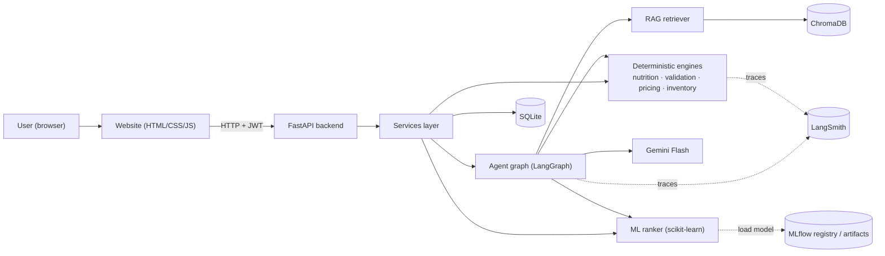
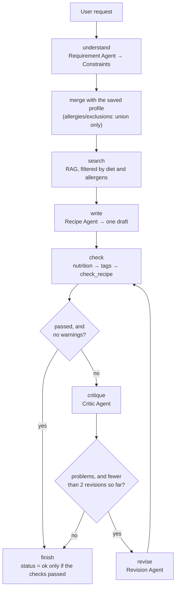
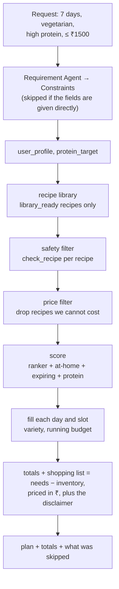
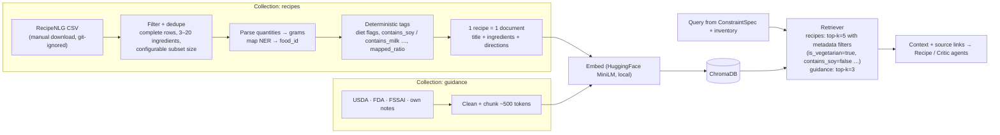
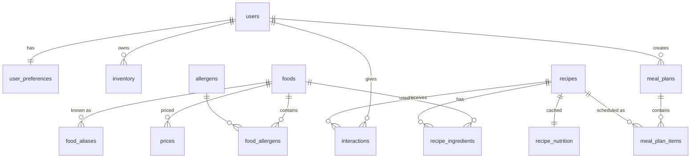
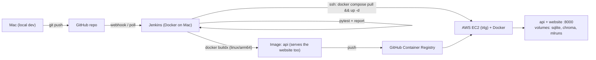

# NutriChef AI — Architecture (v1)

> Constraint-aware personalized meal planning & recipe intelligence platform.
> Status: describes what is built (Phases 0-17, then simplified: fewer files, plain code, a core test set). Sections marked *(Phase N)* are planned, not written yet.
> Nutrition values are estimates. NutriChef is a general wellness / meal-planning tool, not a medical device, and never guarantees allergy safety.

---

## 1. Design principles

1. **LLMs propose, Python decides.** LLMs understand text and write/critique recipes. Nutrition, allergens, diet rules, constraints, prices and ranking are deterministic code or ML.
2. **Safety is sticky.** Allergies and exclusions saved in the profile can be *added to* by the LLM, never removed. A recipe with a hard violation is never returned.
3. **Unknown = unsafe.** An ingredient that can't be mapped to the food database blocks "validated" status until it is replaced or mapped.
4. **Business logic lives in `services/` and engines**, not in API routes or the website.
5. **Everything testable offline.** LLM, embeddings and clock are injectable; tests use fakes.
6. **Simple first.** One process for the API, SQLite + Chroma files, one EC2 host. No Kubernetes, Kafka, Spark or Airflow.

---

## 2. System context

The finished picture.



---

## 3. Layers and responsibilities

| Layer | Folder | Responsibility | Uses LLM? |
|---|---|---|---|
| API | `app/api/` | Routing, request/response schemas, error mapping | No |
| Services | `app/services/` | `recipe_service` (Scenario 1), `planner` (Scenario 2) | No (calls the agents) |
| Agents | `app/agents/` | 4 LLM agents, the LangGraph workflow, their output schemas, RAG search (`rag.py`) | Yes (search: embeddings only) |
| Nutrition engine | `app/nutrition/` | Parse → grams → nutrients and cost; allergen, diet and limit checks (`checks.py`) | No |
| ML | `app/ml/` | Features, ranker, cold-start blend, metrics. Training is `scripts/train_ranker.py` | No |
| Data | `app/data/` | Read USDA / RecipeNLG / reference files, clean them into recipes | No |
| Core | `app/core/` | Settings, logging, the Gemini factory, LangSmith tracing | — |
| Website | `web/` | `index.html`, `styles.css`, `app.js`. Talks HTTP only, never imports the services | No |
| Data access | `app/database/` | `models.py` (4 tables) and `session.py` | No |

Pricing and inventory are not separate modules: prices live in the nutrition calculator
(`price_per_gram`) and inventory handling is a few functions in the planner. Splitting them out
would add files without adding clarity.

---

## 4. Agents — who does what

Four functions call the LLM, in `app/agents/agents.py`. Everything that must be *correct* is
deterministic and lives elsewhere.

| Agent | Input → Output | Where |
|---|---|---|
| Requirement | free text → `Constraints` (diet, allergies, exclusions, targets) | `extract_requirements` |
| Recipe | constraints + RAG context → one `RecipeDraft`, quantities in grams | `generate_recipe` |
| Critic | recipe + our nutrition and check results → `Critique` | `critique_recipe` |
| Revision | recipe + critique → a fixed `RecipeDraft` | `revise_recipe` |

Every answer is cached on disk by `CachedLLM` (`app/core/llm.py`), keyed by the prompt **and**
the model name. The free Gemini tier allows about 20 requests per day per project per model, and
one recipe run costs 2-4 of them, so without a cache a UI is unusable. The trade-off is that a
cached answer is the old answer: change a prompt, clear the cache.

`invoke_with_retry` (same file) sits in `agents.ask`, so all four agents share it. A 503 ("high
demand") is temporary and is retried up to three times with a growing pause; a 429 is the daily
allowance and is not retried at all - it raises `QuotaExhausted`, which the API turns into a 503
with a sentence the person can act on. Together with the cache this means a run that dies
half-way replays its completed steps for free on the next attempt.

The deterministic steps around them: RAG search (`app/agents/rag.py`), nutrition
(`app/nutrition/calculator.py`), tagging and checks (`app/nutrition/checks.py`), ranking
(`app/ml/ranker.py`) and planning (`app/services/planner.py`). The LLM never decides whether a
recipe is safe - `check_recipe` does, and its verdict sets the returned status.

---

## 5. Recipe generation workflow (Scenario 1)



A draft that passes every check with no warnings skips the critic entirely. The critic used to
read every draft, which cost a clean run one Gemini call in three, and a stylistic nitpick could
send a recipe that was already fine through two rewrites. Warnings still go to the critic: a
draft short of the protein target passes the hard rules but is exactly what a rewrite is for.
A draft that breaks a hard rule always does.

**Graph state** (a plain dict, `app/agents/graph.py`): `request_text, profile, constraints, context, sources, draft, recipe, nutrition, checks, critique, revisions, status, trace[]`.

**Hard rules** (must pass, or the status is `failed`): allergens, excluded ingredients, diet rules, the calorie and cost ceilings, nutrition confidence below `high`, and macros that exceed the calories.
**Soft rules** (reported as warnings): protein target, cooking time, cuisine.

**Allergen check detail**: each ingredient's name plus its catalog name is matched against the keyword table with whole-word matching and a plural tolerance, so "eggplant" never counts as "egg". An exceptions list stops "coconut milk" counting as milk (the reference repo's substring matching got both of these wrong).

---

## 6. Meal plan workflow (Scenario 2)

Plain Python functions in `app/services/planner.py`, called in order by `make_plan`. Every step
is deterministic — the LLM's only appearance is the optional first box.



This used to be a LangGraph pipeline too. It was a straight line with no decision to make — a
retry edge that lowered the per-meal budget returned the same plan every time — so it is now
ordinary function calls. LangGraph stays where it earns its place: the recipe loop, which does
branch.

Planner scoring per slot (`app/services/planner.py`):
`score = ranker_score + 0.3 · share_of_ingredients_at_home + 0.2 · uses_something_expiring
         + 0.4 · reaches_the_protein_target`

The ranker score is the Phase 7 model (rule score blended in for new users). Filtering happens
before scoring: only recipes that pass `check_recipe` for this person enter the pool, so
allergens, diet and cost limits are never traded off against a score. When a budget is given,
recipes whose `cost_coverage` is below 0.8 are also dropped: most of their ingredients have no
price, so they look almost free and would otherwise win every slot (the filter is skipped if it
would leave too few recipes to plan with). Slots are filled greedily,
day by day, and variety is tried in three steps: a recipe not yet in the plan at all; failing
that, one not eaten for 3 days; failing that, anything not already eaten today. The running
budget is a hard limit; a slot that cannot be filled is reported in `skipped` rather than
filled unsafely.
The shopping list subtracts what is already at home from what the plan needs and prices the
rest in ₹.

---

## 7. RAG pipeline (two collections)

RecipeNLG (Bień et al., INLG 2020; ~2.2M recipes; columns `title, ingredients, directions, link, source, NER`) is the **recipe knowledge base**. A small guidance corpus covers what RecipeNLG does not (nutrition, allergens, diet rules, substitutions, food safety).



**How RecipeNLG is used**
- **Retrieval-augmented generation:** similar, constraint-compatible recipes are retrieved and the Recipe Agent *adapts* them (use available paneer/eggs, remove whey, hit protein target). Final output cites `Adapted from: <link>`.
- **Recipe library:** parsed rows with ≥ 90 % of ingredients mapped to the food DB are stored in `recipes` (origin=`recipenlg`) with computed nutrition → used by the ML ranker and meal planner.
- **Metadata pre-filtering** removes obviously unsafe recipes before the LLM sees them; the Safety Agent still re-validates everything afterwards (metadata filters are a convenience, not the safety guarantee).
- Recipes are never chunked mid-recipe; Chroma metadata stores allergens/diet as scalar boolean flags.

**Constraints of the dataset (and mitigations)**

| Issue | Mitigation |
|---|---|
| License: *non-commercial research & educational use only*; download requires accepting terms | Project is educational/non-commercial; data never committed to git or baked into Docker images; attribution + terms in `docs/data_sources.md`; public demo labeled non-commercial |
| Recipe text originates from third-party websites | Keep `link`, show source, generate adapted recipes rather than republishing verbatim |
| No nutrition, no allergen labels | Our nutrition engine + allergen tables compute them |
| US-centric, cups/oz, free-text quantities | Fixed parser + unit/density conversion; Indian supplement set (curated, ~50 recipes) |
| 2.2M rows (~2 GB) too large for laptop dev / small EC2 | `RECIPENLG_SUBSET_SIZE` (dev 5k, demo ~50k); prefer `source=Gathered` rows; index built offline and mounted as a volume |
| Duplicates / noisy rows | Normalized-title + ingredient-set dedupe, row-level quality checks |

- Guidance topics: `nutrition`, `allergens`, `diet_rules`, `substitutions`, `cooking`, `food_safety`.
- RAG *informs* the LLM; it never overrides deterministic checks.
- Every source records its license in `docs/data_sources.md`.
- Retrieved text is wrapped as quoted data in prompts (prompt-injection guard — scraped recipe text is untrusted).

---

## 8. ML personalization / ranking

| Item | Decision |
|---|---|
| Task | Pointwise: P(user likes recipe) — label = like / save / rating ≥ 4 (positive) vs dislike / skip / rating ≤ 2 (negative) |
| Models | Baselines: popularity, rule-based score → Logistic Regression → Gradient Boosting |
| Features | 11, in `app/ml/features.py`: calorie_fit, protein_fit, cost_fit, time_fit, cuisine_match, diet_match, ingredient_overlap, inventory_use, is_indian, is_curated, n_ingredients_scaled |
| Data | Simulated users & interactions (labeled `synthetic=true`) + real app feedback over time |
| Split | Per-user time-based leave-last-out (no leakage) |
| Metrics | Precision@K, Recall@K, HitRate@K, NDCG@K (K = 5, 10), plus ROC-AUC |
| Cold start | users with < 5 interactions: `score = α·rule_score + (1−α)·model_score`, α = 1 − n/5 |
| Tracking | MLflow (local SQLite file `mlflow.db`): params and metrics per run; the chosen model is saved to `ml/artifacts/ranker.joblib` |
| Serving | `app/ml/ranker.py` loads `ml/artifacts/ranker.joblib` on demand; if it is missing, the rule score is used |

---

## 9. Data model (SQLite via SQLAlchemy)

Built in Phase 14, but smaller than the plan below: four tables in one file (`app/database/models.py`) - `users`, `profiles`, `inventory`, `feedback` - created with `Base.metadata.create_all()` at startup. No migration tool and no repository layer; the routes use a session directly. The `foods`/`recipes` tables were dropped from the plan because that data lives in files the pipeline rebuilds.



| Table | Key columns |
|---|---|
| `users` | id, email, password_hash, created_at |
| `user_preferences` | user_id, diet, allergens (JSON), exclusions (JSON), cuisines (JSON), calorie_target, protein_target_g, max_cook_minutes, skill_level, budget_per_day |
| `foods` | id, name, category, kcal, protein_g, carbs_g, fat_g, fiber_g (per 100 g), is_vegetarian, is_vegan, source, source_ref |
| `food_aliases` | food_id, alias |
| `allergens` / `food_allergens` | allergen code (milk, egg, soy, peanut, tree_nut, wheat_gluten, fish, shellfish, sesame, mustard …) |
| `diet_rules` | diet, rule_type (forbid_category / forbid_food / require_flag), value |
| `prices` | food_id, price_inr, per_unit (kg/l/piece), region, source, as_of |
| `recipes` | id, name, cuisine, meal_type, cook_minutes, skill, servings, instructions (JSON), origin (recipenlg/curated/generated), source_url, external_id, mapped_ratio, created_at |
| `recipe_ingredients` | recipe_id, food_id, grams, display_qty, display_unit |
| `recipe_nutrition` | recipe_id, per-serving kcal/protein/carbs/fat/fiber, cost_inr, computed_at |
| `inventory` | user_id, food_id, grams, expires_on |
| `interactions` | user_id, recipe_id, event (view/like/dislike/save/skip/rate/cook), value, reason, created_at |
| `meal_plans` / `meal_plan_items` | plan: user_id, start_date, days, budget, totals (JSON); item: day, slot, recipe_id, servings |
| `generation_runs` | id, user_id, kind, iterations, status, latency_ms, model, violations (JSON), created_at — audit/observability |

Feedback is stored as `interactions` with `event` + optional `reason`.

Tables are created at startup with SQLAlchemy `Base.metadata.create_all()` (no migration tool). If the schema changes during development, the local SQLite file is deleted and re-seeded.

---

## 10. API (FastAPI, prefix `/api/v1`)

| Method | Path | Purpose | Auth |
|---|---|---|---|
| POST | `/auth/signup`, `/auth/login` | Account + JWT | – |
| GET/PUT | `/users/me/profile` | Preferences (brief's `POST /users/profile`) | ✔ |
| GET/PUT | `/users/me/inventory` | Ingredient inventory | ✔ |
| POST | `/ingredients/analyze` | Canonicalize + flag ingredients | ✔ |
| POST | `/nutrition/calculate` | Nutrition for an ingredient list | – |
| POST | `/recipes/generate` | Full agent workflow | ✔ |
| POST | `/recipes/validate` | Validation report for a recipe | ✔ |
| POST | `/recipes/revise` | Revise a recipe with instructions | ✔ |
| GET | `/recipes/{id}`, `/users/me/history` | Retrieve | ✔ |
| POST | `/meal-plans/generate` | N-day plan | ✔ |
| POST | `/feedback` | like/dislike/rate/save/skip + reason | ✔ |
| GET | `/health` | liveness + DB/vector store/model status | – |

Errors: FastAPI's own `{"detail": ...}` shape everywhere - 422 for input that fails validation,
503 when a dependency (Gemini key, recipe library) is missing, 500 with a fixed message for
anything unexpected. Internal details and tracebacks only ever go to the logs.

**Built so far** (Phases 13-14):

| Method | Path | Auth | Purpose |
|---|---|---|---|
| GET | `/health` | - | what is ready: recipes, ranking model, search index, LLM key |
| POST | `/api/v1/auth/signup`, `/login` | - | bcrypt + JWT |
| GET/PUT | `/api/v1/users/me/profile` | ✔ | saved diet, allergies, exclusions, targets |
| GET/PUT | `/api/v1/users/me/inventory` | ✔ | what is at home |
| POST | `/api/v1/users/me/feedback` | ✔ | like/dislike, for personalization |
| POST | `/api/v1/recipes/generate` | optional | Scenario 1 |
| POST | `/api/v1/plans/generate` | optional | Scenario 2 |

The two `generate` endpoints accept a token but do not require one. When a token is present the
saved profile is merged in with the union rule - saved allergies and exclusions are added to the
request's, never replaced - so principle 2 ("safety is sticky") holds at the API boundary too.

Both endpoints are thin: validate with Pydantic, call a service
(`app/services/recipe_service.py`, `app/services/planner.py`), return the result. The
services are shared with the demo scripts, so the API and the command line run the same code.

---

## 11. Observability

**LangSmith**, and nothing else. `app/core/tracing.py` is the whole integration: `configure_tracing()`
copies the key, project and endpoint from `.env` into the environment variables LangSmith reads,
once, when the app starts. No key in `.env` means tracing is off and nothing is sent.

No decorators are needed, because LangChain and LangGraph report to LangSmith on their own:

| What | Seen in the trace |
|---|---|
| Every Gemini call: prompt, reply, tokens, time | LangChain |
| The recipe workflow, node by node | LangGraph (`app/agents/graph.py`) |
| The Python verdict | the `check` node's output: nutrition, `passed`, failures, warnings |

So a single recipe request reads: understand → search → write → check → (critique → revise →
check) → finish, and the `check` node shows the half of "the model proposes, Python decides" that
decides.

Logs: `time | level | module | message`, with `RedactSecretsFilter` masking anything that looks
like a key.

**What this costs.** LangSmith sees LLM and graph work only. HTTP routes and status codes are
not traced, and a meal plan sent as structured fields (no free text) never calls the model, so it
leaves no trace at all. That was the deliberate price of using one observability tool, not two.

---

## 11a. Speed

Measured, not guessed: the real library's size (3,133 recipes), the same request and a trained
model file on disk. The plans chosen were identical before and after.

| Meal plan, typical request | Before | After |
|---|---|---|
| Tracing on | 11.2 s | 0.024 s |
| Tracing off | 1.36 s | 0.023 s |

| Recipe | Gemini calls before | after |
|---|---|---|
| First draft clean | 3 | 2 |
| Unsafe, fixed in one rewrite | 5 | 4 |

What was slow, and what changed:

1. **The ranker's answer was computed and thrown away.** With no interaction history its weight is
   zero, but it still ran for every safe recipe. It is now skipped at weight zero.
2. **Tracing sat on functions called once per recipe** — thousands of LangSmith runs per plan.
   Those decorators are gone; only LangChain and LangGraph report.
3. **The model file was read on every plan.** Now once per process (`planner.load_dependencies`,
   cached with `lru_cache`).
4. **Every request fetched its trace link** from LangSmith. Removed.
5. **A busy Gemini meant up to 45 s of sleeping per call.** Retry waits are now 4 s then 8 s, and
   the answer cache replays finished steps for free.
6. **The critic read drafts Python had already passed** (§5).
7. **Every Gemini call thought at "medium"** (the model's default). All calls now ask for `low`
   (`LLM_THINKING` in `.env`).
8. **Answers came back as prose around JSON.** Every call now asks for `application/json` only.

The first request after the server starts loads the library and tables, so it is slower than the
rest (there is no background warm-up — it was removed to keep start-up simple).

Items 7 and 8 can only be timed against Gemini itself:
`python -m scripts.demo recipe --no-cache --thinking medium`, then `--thinking low`, prints each
step's seconds. Compare the revision count too — if the writer misses targets more often at
`low`, set `LLM_THINKING=medium`.

---

## 12. Security & responsible AI

- Secrets only in `.env` (git-ignored); `.env.example` committed. `pydantic-settings` fails fast if missing.
- JWT bearer tokens (the website keeps one in the browser), bcrypt hashes, 60-minute expiry.
- Pydantic limits on every input (text length, days ≤ 14, budget > 0, list sizes …).
- Free-tier quota is protected by the answer cache and by not retrying a 429. There is no per-user rate limit yet (a Phase 22 hardening item).
- Prompt injection: raw user text only reaches the Requirement Agent, inside delimiters; downstream agents receive structured data; all LLM output is schema-validated; safety is deterministic anyway.
- Disclaimers in every recipe/plan response and in the UI.
- Minimal personal data: email, password hash, profile, inventory, feedback. Account deletion is not built yet (Phase 22).

---

## 13. Deployment

*(Phases 18-20 - not built yet.)*



- **Docker** = packaging/runtime. **GHCR** = image storage. **Jenkins** = automation. **AWS EC2** = the machine. **FastAPI** = the backend inside the container.
- Billing alarm before any AWS resource; security group opens only 22 (your IP) and 80/443.

---

## 14. Repository layout

Every file here is used; anything that stopped being used has been deleted.

```text
nutrichef-ai/
├── app/
│   ├── api/          main.py (the app), routes.py, auth.py, users.py, schemas.py
│   ├── agents/       prompts.py, agents.py (4 LLM agents), graph.py (LangGraph workflow),
│   │                 schemas.py (the LLM output contract), rag.py (ChromaDB search)
│   ├── core/         config.py, logging.py, llm.py, security.py, tracing.py
│   ├── data/         usda.py, recipenlg.py, reference.py, recipes.py, features.py
│   ├── database/     models.py (4 tables), session.py
│   ├── ml/           features.py, ranker.py, metrics.py
│   ├── nutrition/    parsing.py, units.py, food_matcher.py, calculator.py,
│   │                 checks.py (allergens, diets, limits - the safety layer)
│   └── services/     recipe_service.py (Scenario 1), planner.py (Scenario 2)
├── web/              index.html, styles.css, app.js (served by FastAPI)
├── ml/artifacts/     ranker.joblib (git-ignored)
├── data/
│   ├── reference/    7 CSVs - catalog, allergen and food-group keywords, exceptions,
│   │                 diets, prices, curated recipes (committed)
│   ├── knowledge_base/  markdown docs for RAG (committed)
│   └── raw/ processed/ interactions/   (git-ignored, rebuilt by the scripts)
├── scripts/          build_data.py, train_ranker.py, demo.py, check.py
├── tests/            one file per area + conftest.py, helpers.py
├── docs/             architecture.md, data_sources.md
├── requirements.txt  requirements-dev.txt  pytest.ini  .env.example  .gitignore
└── README.md
```

`python -m scripts.build_data` runs every step in this order (or name the steps you want);
`python -m scripts.train_ranker` then simulates users and trains the ranker:

```text
usda ─────────┐
recipenlg ────┴─> foods -> recipes -> nutrition -> tags -> index
                                                    └─> train_ranker (simulate users, train)
```

---

## 15. Key decisions (short ADRs)

| # | Decision | Alternatives | Reason |
|---|---|---|---|
| 1 | LangGraph for the recipe loop | Plain Python loop | Explicit state + conditional edge fits generate→validate→critique→revise; still ~100 lines |
| 2 | Deterministic nutrition from USDA (+ cited Indian values) | LLM estimates, paid APIs | Correctness, free, public-domain |
| 3 | RecipeNLG subset as RAG knowledge base + recipe library, plus ~50 curated Indian recipes | Fully curated library; other scraped datasets | Large, well-known research dataset with NER field; non-commercial terms accepted for this educational project |
| 4 | Greedy planner | ILP solver (PuLP) | Easy to understand; ILP is a possible later upgrade |
| 5 | SQLite + Chroma files | Postgres + pgvector | Zero setup; swap later via SQLAlchemy |
| 6 | Bearer JWT | Cookies (reference repo) | One token the browser sends on each call; no session store, no CSRF handling |
| 7 | EC2 + compose, GHCR | ECS Fargate + ECR | Free-tier budget; ECS remains an upgrade path |
| 8 | Synthetic interactions, clearly labeled | No ML until real users | Enables a genuine, evaluated model now |

---

## 16. Phase map

| Phases | Delivers |
|---|---|
| 2 | Repo, venv, config, logging, tooling |
| 3–4 | USDA foods, allergens, diet rules, prices, RecipeNLG download + filtering/parsing, curated Indian recipes, guidance docs, features |
| 5–6 | Nutrition engine, validation |
| 7 | Ranker + MLflow |
| 8 | RAG |
| 9–11 | Agents, graph, recipe generation |
| 12 | Meal planning, inventory, waste, budget |
| 13–15 | API, DB integration, the website |
| 16–17 | Test suite, observability |
| 18–20 | Docker, Jenkins, EC2 |
| 21–24 | E2E, hardening, docs, demo |
