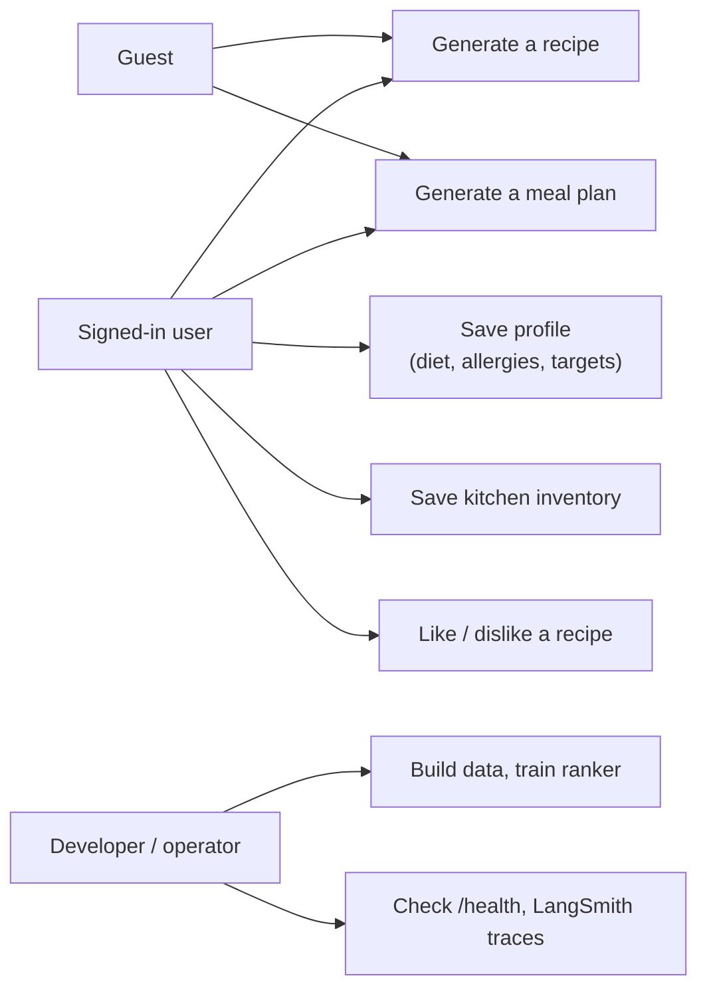

# NutriChef AI — Software Requirements Specification (v2)

> Constraint-aware personalized meal planning & recipe intelligence platform.
> Status: v2 matches the code on `main` after the simplification. Every requirement is marked **Met**, **Partly met** or **Not yet**, and requirements that are met name the test that checks them.
> Nutrition values are estimates. NutriChef is a general wellness / meal-planning tool, not a medical device, and never guarantees allergy safety.

---

## 1. Introduction

### 1.1 Purpose

This document states what NutriChef AI must do and how well it must do it. It is written for
the project mentor and evaluators, for anyone extending the code, and as the checklist that the
test suite is traced against (section 6). The companion document, *Architecture (v2)*, explains
how the requirements are met.

### 1.2 Scope

NutriChef AI is a web application that:

- turns a plain-language food request into **one recipe** whose nutrition, allergens and diet
  suitability are computed and checked by deterministic Python code (Scenario 1);
- builds a **multi-day meal plan** inside a budget, using ingredients already at home, with a
  priced shopping list (Scenario 2);
- stores a user's diet, allergies, targets, kitchen inventory and likes/dislikes.

It is not a medical device, gives no medical advice, and does not guarantee allergy safety.
It is an educational, non-commercial project.

### 1.3 Definitions

| Term | Meaning |
|---|---|
| LLM | Large language model; here Google Gemini Flash, called through LangChain |
| Agent | One step of the recipe workflow. The Requirement Agent and the critic are plain Python; the Recipe and Revision Agents call the LLM and validate the reply |
| Hard rule | A check a recipe must pass, or it is reported as `failed` |
| Warning | A check that is reported but does not fail a recipe |
| Recipe library | The pre-built set of tagged recipes (`recipes_tagged.jsonl`) the planner chooses from |
| RAG | Retrieval-augmented generation: similar recipes are found in ChromaDB and shown to the LLM |
| Inventory | Ingredients the user has at home, optionally with grams and days until expiry |
| Union rule | Saved allergies/exclusions are always added to a request's, never replaced |
| Cold start | A user with fewer than 5 interactions; ranked mostly by rules, not the model |

### 1.4 References

- *NutriChef AI — Architecture (v2)*, `docs/architecture.md`
- `docs/data_sources.md` — USDA FoodData Central, RecipeNLG (Bień et al., INLG 2020), FDA and FSSAI allergen lists, price sources
- `README.md` — setup and commands

---

## 2. Overall description

### 2.1 Product perspective

A self-contained system: one FastAPI process serves the API and the website, with SQLite for
user data, files for the recipe library and ChromaDB for search. External services are Gemini
(required to write recipes) and LangSmith (optional tracing).

### 2.2 Product functions

1. Accounts: sign up, log in, JWT-authenticated requests.
2. Profile, inventory and feedback storage per user.
3. Recipe generation with a generate → check → critique → revise loop.
4. Deterministic nutrition, cost, allergen, diet and limit checks.
5. Meal planning with budget, variety, inventory use and a shopping list.
6. Ranking of recipes by fit (rules, plus an ML model as history grows).
7. Offline data pipeline and model training.
8. Health reporting and LangSmith tracing.

### 2.3 User classes

| User | Needs |
|---|---|
| Guest | Try recipes and plans without an account; must state allergies each time |
| Signed-in user | Saved allergies and diet applied automatically; saved kitchen used in plans |
| Developer / operator | Rebuild data, retrain, run tests, inspect traces |

### 2.4 Operating environment

- Python 3.11; macOS for development; Linux container for deployment (planned).
- A modern browser (desktop or phone) for the website.
- Internet access for Gemini, and for LangSmith if enabled; the embedding model runs locally.

### 2.5 Design constraints

- **LLMs propose, Python decides**: nutrition, allergens, diet, limits, prices and ranking are
  never decided by the LLM.
- Free Gemini tier: roughly 20 requests per model per day, so answers are cached on disk.
- RecipeNLG is licensed for non-commercial use only and is never committed or shipped.
- Secrets only in `.env` (git-ignored); `.env.example` documents the variables.
- Simple, beginner-readable code: no background workers, no migration tool, no microservices.

### 2.6 Assumptions and dependencies

- Nutrition comes from USDA SR Legacy, plus cited values for Indian ingredients.
- Prices in ₹ are approximate and hand-collected.
- The ranker is trained on simulated users until real feedback accumulates.
- Allergen detection is keyword-based on ingredient names; it cannot see brand formulations,
  cross-contamination or unlisted ingredients.

---

## 3. External interface requirements

### 3.1 User interface

| ID | Requirement | Status |
|---|---|---|
| UI-1 | Served at `/` by the same process as the API | Met |
| UI-2 | Pages for a recipe request, a meal plan and "My kitchen" (profile and inventory), plus sign-in | Met |
| UI-3 | Usable on a phone-width screen | Met |
| UI-4 | Shows the nutrition-and-allergy disclaimer with every result | Met |
| UI-5 | Talks to the backend over HTTP only (never imports Python code) | Met |

### 3.2 API

REST over HTTP, JSON bodies, prefix `/api/v1` (plus `/health`), bearer JWT in the
`Authorization` header. Interactive documentation at `/docs`. Errors are `{"detail": "..."}`.
The endpoint list is in *Architecture (v2)*, section 10.

### 3.3 Software interfaces

| System | Use | Required |
|---|---|---|
| Google Gemini (via `langchain-google-genai`) | Recipe and Revision Agents; JSON-only replies, temperature 0, fixed seed | For Scenario 1 only |
| ChromaDB + MiniLM embeddings | recipe search | Optional (recipe runs without it) |
| SQLite (SQLAlchemy) | user data | Yes |
| MLflow | training runs | Training only |
| LangSmith | traces | Optional |

---

## 4. Functional requirements

### 4.1 Accounts and authentication

| ID | Requirement | Status |
|---|---|---|
| FR-1 | A user can sign up with an email and a password of 8–72 characters | Met |
| FR-2 | Passwords are stored only as bcrypt hashes | Met |
| FR-3 | A password longer than bcrypt's 72-byte limit is refused, not silently shortened | Met |
| FR-4 | An email can be registered once (409 on repeat) | Met |
| FR-5 | Login returns a JWT that expires (default 60 minutes) | Met |
| FR-6 | A wrong password and an unknown email give the same 401 message | Met |
| FR-7 | Expired tokens and tokens signed with another secret are refused | Met |

### 4.2 Profile, inventory and feedback

| ID | Requirement | Status |
|---|---|---|
| FR-8 | A signed-in user can read and replace their profile: diet, allergies, exclusions, min protein, max kcal, max cook time, budget per meal | Met |
| FR-9 | Unknown diets and allergens are dropped, not stored | Met |
| FR-10 | A signed-in user can read and replace their inventory (ingredient, grams, days to expiry) | Met |
| FR-11 | A signed-in user can like or dislike a recipe, with an optional reason | Met |
| FR-12 | A user can delete their account and all their data | **Not yet** |

### 4.3 Recipe generation (Scenario 1)

| ID | Requirement | Status |
|---|---|---|
| FR-13 | Accept a free-text request of 3–1,000 characters | Met |
| FR-14 | The Requirement Agent (plain Python, no LLM) turns it into structured constraints using fixed word lists and numbers with units; only known diets and allergen codes can come out | Met |
| FR-15 | Saved allergies and exclusions are added to the request's (union rule), never removed | Met |
| FR-16 | Similar recipes, searched with the person's own words, that pass the diet, allergen and calorie filters are retrieved and given to the Recipe Agent, with their source links | Met |
| FR-17 | The Recipe Agent writes one recipe of the kind the person asked for (it sees their words, fenced as data), with quantities in grams or millilitres | Met |
| FR-18 | Nutrition and cost are computed by the calculator from the food tables, never taken from the LLM | Met |
| FR-19 | Every draft is checked by `check_recipe` (section 4.4) | Met |
| FR-20 | A draft that passes with no warnings is returned without calling the critic | Met |
| FR-21 | A draft with a failure or warning goes to the critic (plain Python), which lists each problem, the exact ingredients that caused it and safe swaps that break no other rule; the Revision Agent replaces them and the recipe is checked again | Met |
| FR-22 | At most 2 rewrites; the result is `ok` only if the final checks passed, otherwise `failed` with the reasons | Met |
| FR-23 | The response includes the recipe, nutrition, check results, sources, the steps taken and the disclaimer | Met |

### 4.4 Safety and constraint checks

| ID | Requirement | Status |
|---|---|---|
| FR-24 | Allergens (10 codes, FDA/FSSAI based) are found by whole-word matching with plural tolerance ("eggplant" is not egg) | Met |
| FR-25 | Known exceptions are respected ("coconut milk" is not milk) | Met |
| FR-26 | **Hard rules**: listed allergen, excluded ingredient, diet violation, over the calorie limit, over the cost limit, nutrition confidence below high (an unidentified ingredient), macros that exceed the calories | Met |
| FR-27 | **Warnings**: below the protein target, over the cooking time, a different cuisine | Met |
| FR-28 | The diets a recipe suits are derived from its food groups (6 diets, including Jain) | Met |

### 4.5 Meal planning (Scenario 2)

| ID | Requirement | Status |
|---|---|---|
| FR-29 | Accept either free text (read by the Python Requirement Agent, no Gemini key needed) or structured fields; 1–14 days; 1–6 slots per day | Met |
| FR-30 | Only recipes that pass the hard rules for this person can be chosen | Met |
| FR-31 | When a budget is given, the plan's total cost never exceeds it; a budget of zero buys nothing | Met |
| FR-32 | Recipes with less than 80 % of ingredient cost known are not used when a budget applies | Met |
| FR-33 | No recipe twice in one day; a recipe is not repeated within 3 days while alternatives exist | Met |
| FR-34 | Recipes that use food at home, or food expiring within 3 days, score higher | Met |
| FR-35 | A slot is never filled with an unsafe recipe. If no recipe of its own course fits (e.g. every breakfast removed by an allergy and a dislike), a safe light dish from a nearby course fills it, marked as a stand-in; a slot nothing can fill is reported as skipped with the real reason (no recipe fits, or the budget ran out) | Met |
| FR-35a | With a budget, each pick keeps back enough for the cheapest possible meal in every slot still to fill, so later days are not left empty | Met |
| FR-36 | The plan reports totals, whether the daily protein goal was met, and a shopping list of what is needed minus what is at home, priced in ₹ | Met |
| FR-37 | A signed-in user's saved kitchen is used when the request sends no inventory | Met |

### 4.6 Ranking and personalization

| ID | Requirement | Status |
|---|---|---|
| FR-38 | Each candidate recipe gets a score from 0 to 1 from 11 features | Met |
| FR-39 | Without a trained model, a weighted rule score is used | Met |
| FR-40 | A user's own likes and dislikes change their plans: disliked recipes never return, liked ones and similar ones (same cuisine, shared ingredients) rank higher, and the model's weight grows with the number of ratings (min(n, 5)/5) | Met |
| FR-40a | Every meal in a plan has Like / Not for me for signed-in users, and a plan built from ratings says so | Met |
| FR-41 | The ranker is evaluated with Precision@5, Recall@5, HitRate@5, NDCG@5 and ROC-AUC, logged to MLflow | Met |

### 4.7 Data pipeline and operations

| ID | Requirement | Status |
|---|---|---|
| FR-42 | One command builds all data in order (usda, recipenlg, foods, recipes, nutrition, tags, index); single steps can be named | Met |
| FR-43 | One command simulates users and trains the ranker | Met |
| FR-44 | All 50 curated Indian recipes reach the library | Met |
| FR-45 | `GET /health` always answers, and says whether the recipes, model, search index and LLM key are ready | Met |
| FR-46 | A demo command runs either scenario from the terminal using the same services as the API | Met |

---

## 5. Non-functional requirements

### 5.1 Performance

| ID | Requirement | Status |
|---|---|---|
| NFR-1 | A 7-day, 3-meal plan over the full library (~3,100 recipes) is built in under 1 second after the first request | Met — measured ≈ 24 ms, tracing on or off |
| NFR-2 | A clean recipe costs 1 Gemini call; one rewrite costs 2 | Met |
| NFR-3 | A repeated prompt is answered from the disk cache without calling Gemini | Met |
| NFR-4 | Gemini "busy" (503) errors are retried up to 3 times with 4 s then 8 s waits; a timeout, or still busy after that, is a clear 503 ("Gemini is busy… try again in a minute"), not a 500 | Met |

### 5.2 Reliability and error handling

| ID | Requirement | Status |
|---|---|---|
| NFR-5 | An exhausted daily quota (429) is not retried and becomes a clear 503 message | Met |
| NFR-6 | A missing Gemini key or recipe library gives a clear 503, not a crash | Met |
| NFR-7 | A malformed LLM answer is asked for once more, then rejected | Met |
| NFR-8 | Unexpected errors return a fixed 500 message; details only go to the logs | Met |
| NFR-23 | Deterministic results. The Requirement Agent, the critic, the checks and the planner are truly deterministic (plain Python). The two Gemini agents are repeatable: saved answers, temperature 0 and a fixed seed give the same recipe for the same request; clearing the cache or changing a prompt, model or index starts fresh | Met |

### 5.3 Security and privacy

| ID | Requirement | Status |
|---|---|---|
| NFR-9 | No secret in code or git; `.env` is git-ignored | Met |
| NFR-10 | API keys are `SecretStr` and never printed; logs mask anything that looks like a key | Met |
| NFR-11 | In production, a weak or placeholder JWT secret (under 32 characters) stops the app from starting | Met |
| NFR-12 | Every input has size and range limits (text ≤ 1,000 chars, days ≤ 14, ≤ 10 allergies, ≤ 100 inventory items …) | Met |
| NFR-13 | Prompt injection: the person's words reach the LLM only fenced as data (and cannot close the fence), the hard limits are read by Python, all LLM output is schema-validated, and safety does not depend on the LLM | Met |
| NFR-14 | Only minimal personal data is stored: email, password hash, profile, inventory, feedback | Met |
| NFR-15 | A per-user rate limit on the LLM endpoints | **Not yet** |

### 5.4 Responsible AI

| ID | Requirement | Status |
|---|---|---|
| NFR-16 | Every recipe and plan response, and the website, carries the estimate / not-medical-advice / check-the-label disclaimer | Met |
| NFR-17 | The system never claims a recipe is allergy-safe; it reports which checks passed | Met |
| NFR-18 | Synthetic training data is labelled as synthetic in MLflow and in the model info | Met |

### 5.5 Maintainability, testability, observability, portability

| ID | Requirement | Status |
|---|---|---|
| NFR-19 | The test suite runs offline with no API key, using a fake LLM (114 tests; 3 need the real data) | Met |
| NFR-20 | Business logic is in services and engines, not in routes or the website | Met |
| NFR-21 | With a LangSmith key, every LLM call and every recipe-workflow step is traced; without one nothing is sent | Met |
| NFR-22 | Runs in a Docker container (non-root, health-checked, no secrets or licensed data in the image); Jenkins tests every pushed change from a clean copy (with a test report), builds the image and checks that it starts; deploys to AWS EC2 | Met |

---

## 6. Traceability (requirement → test)

All tests are in `tests/`. Run with `python -m pytest -q`.

| Requirements | Tests |
|---|---|
| FR-1, FR-4, FR-5 | `test_auth.py`: `test_sign_up_then_log_in`, `test_the_same_email_cannot_sign_up_twice` |
| FR-2, FR-3 | `test_auth.py`: `test_a_stored_password_is_a_hash_not_the_password`, `test_a_password_bcrypt_would_quietly_cut_short_is_refused` |
| FR-6, FR-7 | `test_auth.py`: `test_a_wrong_password_and_an_unknown_email_look_the_same`, `test_an_expired_token_is_refused`, `test_a_token_signed_with_another_secret_is_refused` |
| FR-8, FR-15, FR-37 | `test_auth.py`: `test_a_saved_profile_comes_back`, `test_saved_allergies_are_added_to_a_plan_request`, `test_a_request_cannot_drop_a_saved_allergy`, `test_the_saved_kitchen_is_used_when_the_request_sends_none` |
| FR-14, NFR-13 | `test_agents.py`: `test_the_request_is_read_without_an_llm`, `test_eggs_at_home_do_not_make_a_vegetarian_eat_eggs`, `test_allergies_are_found_in_everyday_wording`, `test_a_list_stops_where_the_next_part_of_the_sentence_starts`, `test_numbers_are_read_with_their_units`, `test_the_persons_text_is_fenced_off_as_data` |
| FR-15 | `test_agents.py`: `test_saved_allergies_are_only_ever_added`, `test_a_saved_allergy_fails_a_recipe_the_request_never_mentioned` |
| FR-17 | `test_agents.py`: `test_the_dish_they_asked_for_reaches_every_gemini_prompt` |
| FR-16 | `test_agents.py`: `test_search_uses_their_words_and_the_results_reach_the_recipe_prompt`, `test_search_skips_allergens_wrong_diets_and_too_many_calories` |
| FR-18 | `test_agents.py`: `test_nutrition_comes_from_the_calculator_not_the_llm`; `test_nutrition.py` (14 tests) |
| FR-20 – FR-22, NFR-2 | `test_agents.py`: `test_a_clean_first_draft_takes_one_gemini_call`, `test_an_unsafe_draft_is_rewritten_until_it_passes`, `test_breaking_a_hard_rule_always_goes_to_the_critic`, `test_a_draft_short_on_protein_is_rewritten_too`, `test_it_gives_up_after_two_rewrites_and_says_so` |
| FR-29 | `test_api.py`: `test_a_plan_in_plain_words_needs_no_gemini_key` |
| FR-21 | `test_agents.py`: `test_the_rewrite_is_told_exactly_which_ingredient_to_replace`, `test_swaps_never_break_another_allergy`, `test_every_prompt_lists_what_counts_as_each_allergy`, `test_a_second_rewrite_is_a_new_question_not_a_saved_answer` |
| FR-21, NFR-23 | `test_agents.py`: `test_the_same_words_always_give_the_same_constraints`, `test_the_critic_gives_the_same_answer_every_time`, `test_the_same_request_always_gives_the_same_recipe`, `test_gemini_is_asked_for_its_most_likely_answer` |
| FR-24 – FR-28 | `test_checks.py` (12 tests) |
| FR-30 – FR-36 | `test_planner.py` (14 tests, including `test_no_breakfast_left_means_a_light_stand_in_not_an_empty_slot`, `test_the_budget_is_paced_so_the_last_days_are_not_empty`, `test_a_slot_nothing_can_fill_is_left_empty_and_says_why`) |
| FR-38 – FR-41 | `test_ml.py` (7 tests) |
| FR-40 | `test_planner.py`: `test_a_disliked_recipe_never_comes_back`, `test_a_liked_recipe_and_similar_ones_rank_higher`, `test_ratings_turn_the_ranking_model_on`; `test_auth.py`: `test_likes_and_dislikes_reach_the_planner` |
| FR-44 | `test_data.py`: `test_every_curated_recipe_makes_it_into_the_library` |
| FR-45, UI-1 | `test_api.py`: `test_health_always_answers`, `test_the_website_is_served`, `test_the_website_does_not_hide_the_api` |
| NFR-3 – NFR-5, NFR-7 | `test_agents.py`: `test_a_repeated_prompt_is_answered_from_the_cache`, `test_a_busy_gemini_is_retried`, `test_an_empty_daily_quota_is_not_retried`, `test_a_malformed_answer_is_asked_for_once_more` |
| NFR-5, NFR-6, NFR-8, NFR-12 | `test_api.py`: `test_a_used_up_quota_is_a_clear_503`, `test_no_gemini_key_is_a_clear_503`, `test_our_errors_never_leak_to_the_caller`, `test_bad_recipe_requests_are_rejected` |
| NFR-10, NFR-11 | `test_auth.py`: `test_the_gemini_key_is_never_printed`, `test_production_refuses_the_placeholder_jwt_secret` |
| NFR-16 | `test_planner.py`: `test_every_plan_carries_the_disclaimer` |

---

## 7. Open items

| Item | Requirement | Planned |
|---|---|---|
| Account deletion endpoint | FR-12 | Phase 22 (hardening) |
| Per-user rate limit on LLM endpoints | NFR-15 | Phase 22 (hardening) |
| Use the guidance collection in the recipe workflow | — | Optional |
